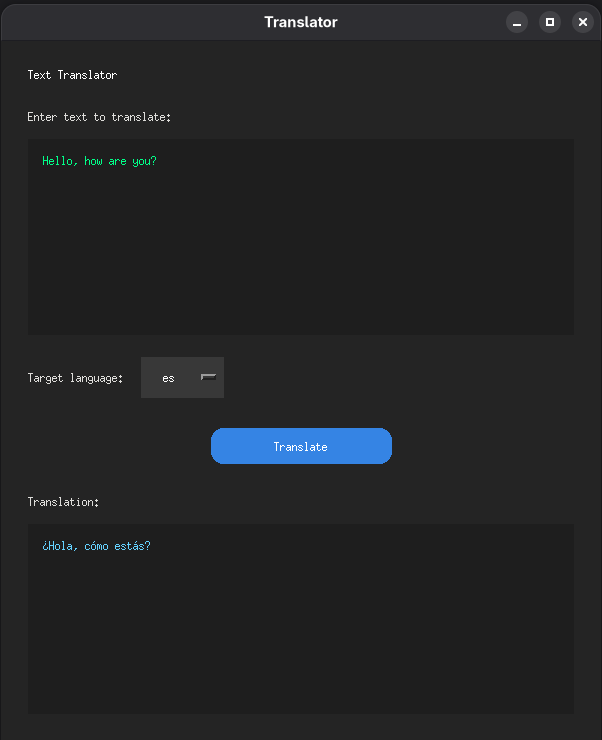

# Language Translator Tool

This project provides a tool for language translation. It is built using Python and leverages `uv` for dependency management.


## Prerequisites

*   **Python:** Version 3.12.
*   **uv:** A fast Python package installer and manager.

## Setup and Installation

This project uses `uv` for managing Python dependencies.

1.  **Install `uv`:**
    If you don't have `uv` installed, you can install it using pip:
    ```bash
    pip install uv
    ```
    Alternatively, you can install it directly from its source:
    ```bash
    curl -LsSf https://github.com/astral-sh/uv/releases/download/v0.1.10/uv-x86_64-unknown-linux-gnu.tar.gz | tar xz
    sudo mv uv /usr/local/bin/
    ```
    *(Note: The above command installs a specific version. For the latest, refer to the official `uv` documentation.)*

2.  **Clone the repository:**
    If you haven't already, clone the project repository:
    ```bash
    git clone https://github.com/dimipash/AI_Machine_Learning_projects.git
    cd AI_Machine_Learning_projects/language_translator_tool
    ```

3.  **Install dependencies:**
    Use `uv` to install the project's dependencies defined in `pyproject.toml`:
    ```bash
    uv pip install .
    ```
    This command will create a virtual environment (if one doesn't exist) and install all necessary packages.

## Running the Application

To run the language translator tool, execute the main Python script:

```bash
uv run main.py
```

*(Note: If the application has a GUI, you might need to run specific GUI-related scripts like `gui.py` or `gui_GNOME.py`. Adjust the command as necessary based on the project's entry points.)*

## Screenshot



